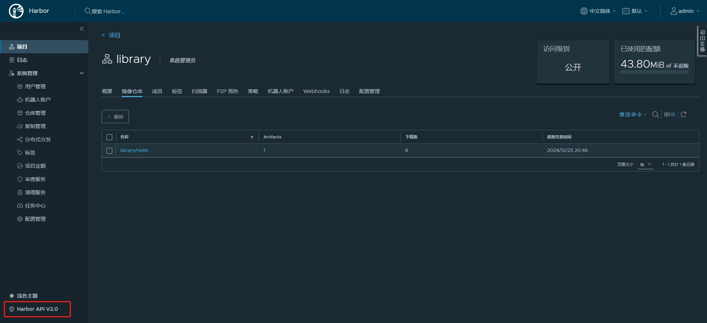

# SpringBoot创建docker镜像，并推送到私有仓库


## 1. 准备环境

### 1.1 安装Harbor 2.0.1

新建项目


### 1.2 Docker配置

```bash
vi /etc/docker/daemon.json
{
    "registry-mirrors":["https://docker.mirrors.ustc.edu.cn"],
    "insecure-registries": ["192.168.2.100:88"],
    "exec-opts":["native.cgroupdriver=systemd"],
    "hosts": ["tcp://0.0.0.0:2375", "unix:///var/run/docker.sock"]
    "data-root": "/data/docker",   
}
```

```bash
docker login -u admin -p Harbor12345 http://192.168.2.100:88
```

## 2. 使用插件构建并推送镜像

### 2.1 编写Dockerfile

```bash
FROM openjdk:8-jre-alpine
COPY target/*.jar /app.jar
EXPOSE 8080
ENTRYPOINT ["sh","-c","java -Xms128m -Xmx128m -Djava.security.egd=file:/dev/./urandom -jar /app.jar"]
```

### 2.2 推送镜像

   ```bash
mvn clean package
   ```

### 2.3 镜像拉取 

   ```bash
docker pull 192.168.2.100:88/ec_platform/spring-boot-harbor:1.0
   ```

### 2.4 运行镜像

   ```bash
docker run -dit -p 8080:8080 --name spring-boot-harbor 192.168.2.100:88/ec_platform/spring-boot-harbor:1.0
   ```

### 2.5 访问地址

   - http://192.168.2.200:8080/doc.html 
   - http://192.168.2.200:8080/login


## 3. Harbor Api

完整API通过控制台左下角链接点击查看



查询用户信息
```bash
curl -u "admin:Harbor12345" -X 'GET' \
  'http://172.17.17.37/api/v2.0/users/search?page=1&page_size=10&username=admin' \
  -H 'accept: application/json'
```


查询项目下所有仓库列表
```bash
curl -u "admin:Harbor12345" -X 'GET' \
  'http://172.17.17.37/api/v2.0/projects/vjspcloud/repositories?page=1&page_size=10' \
  -H 'accept: application/json'
```

查询项目下具体一个仓库的汇总信息：推送次数、产品数量、最后更新时间
```bash
curl -u "admin:Harbor12345" -X 'GET' \
  'http://172.17.17.37/api/v2.0/projects/vjspcloud/repositories/code-server' \
  -H 'accept: application/json'
```

查询项目下具体一个仓库的所有标签
```bash
curl -u "admin:Harbor12345" -X 'GET' \
  'http://172.17.17.37/api/v2.0/projects/vjspcloud/repositories/code-server/artifacts' \
  -H 'accept: application/json'
```